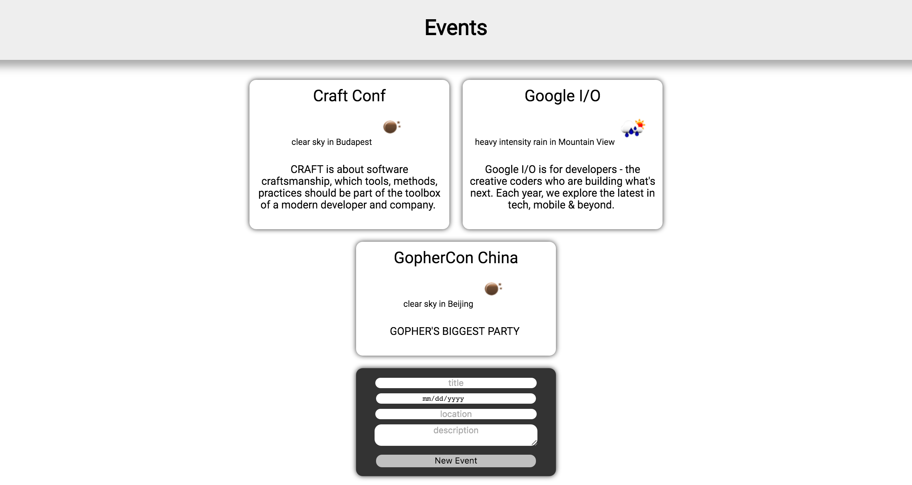

# Events

The goal of this workshop is to create from scratch and deploy a web application
written in Go and running on Google App Engine.

The application is an event manager with weather information for each event. Cool, right?
It doesn't look amazing, but hey ... I'm *really* not a frontend engineer. 😅

The implementation will be done in six steps starting, obviously, with the step 0.

- [Step 0: basic architecture](step0/README.md)
- [Step 1: JSON and local storage](step1/README.md)
- [Step 2: durable storage](step2/README.md)
- [Step 3: adding weather with openweathermap.org](step3/README.md)
- [Step 4: storing temporary results in Memcache](step4/README.md)
- [Step 5: final version of the application](step5/README.md)

Every thing you need to do corresponds to an comment in the code, so don't miss any!
