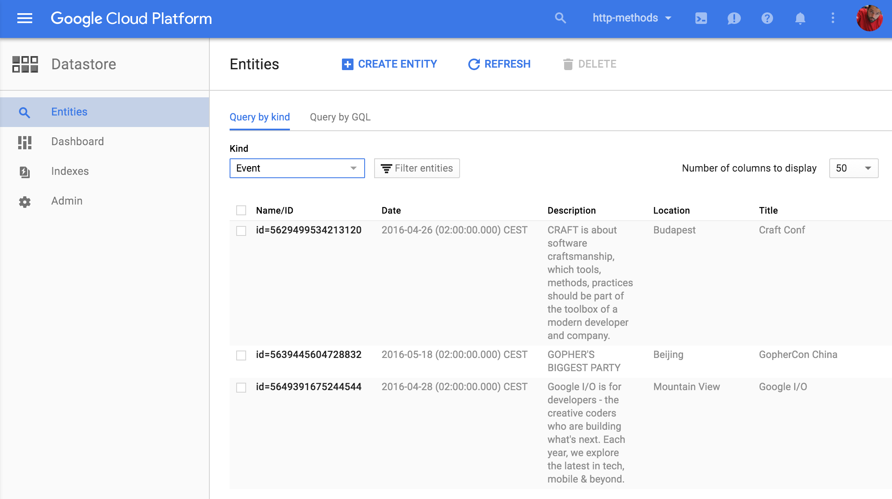

# Step 2: durable storage

This step adds durable storage by using [Google Cloud Datastore][1].
You can learn more about it by reading the docs.

Everything we're going to use is the [Put][2] operation and [Queries][3].
When you see your application working again you should have a look at the
Datastore Console either [the local one][4]. or the one on [Google Cloud Console][5].

Once you're done, go back to the instructions on [datastore](../../section07/README.md#congratulations).

[1]: https://cloud.google.com/appengine/docs/go/datastore/
[2]: https://cloud.google.com/appengine/docs/go/datastore/reference#Put
[3]: https://cloud.google.com/appengine/docs/go/datastore/queries
[4]: http://localhost:8000/datastore?kind=Event
[5]: https://console.cloud.google.com/datastore
