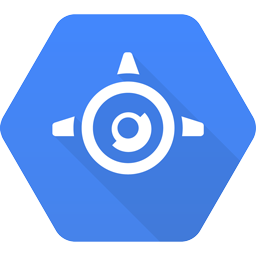
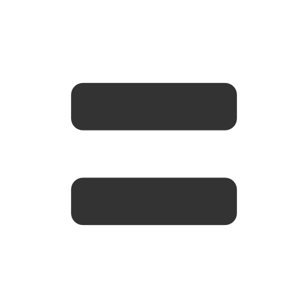

# 4: Deploying to App Engine

In the previous chapter we learned how to write a simple HTTP server in Go as a
static binary that you can execute easily on any server with the same platform.

## Getting ready for success

What would happen if your "Hello, web" went viral? Would your simple binary
handle the load? You would probably need to add some extra servers, which is
probably a good idea just to have redundancy.

How do you that? Many solutions, but the simplest one is Google App Engine.

<div>
</img>
</img>
</img>
</img>
</img>
</div>

With Google App Engine you provide your code and Google is responsible for
handling any amount of traffic you may get, making sure all servers are up
so you don't need to worry about them. Check the
[docs](https://cloud.google.com/appengine/docs) out for more info, this is a
workshop after all, not a marketing document.

## From Hello, web to Hello, App Engine

Moving from a stand alone server to an App Engine app is quite simple, let's
go through the process.

### Adapt the Go code

When you deploy some code to the Google App Engine servers you don't provide a
binary but just some code that will be compiled and linked on Google servers.

This means you don't define either the `main` package or the `main` function.
Also you don't have to choose what port you listen to as App Engine will also
manage that for you.

This simplifies the code we had before:

[embedmd]:# (examples/hello.go /package hello/ $)
```go
package hello

import (
	"fmt"
	"net/http"
)

func helloHandler(w http.ResponseWriter, r *http.Request) {
	fmt.Fprintln(w, "Hello, App Engine")
}

func init() {
	http.HandleFunc("/hello", helloHandler)
}
```

As you can see we still need to register our handler, and since that needs to
happen before the App Engine app starts listening for request we do it in an
`init` functions. All `init` functions in a Go program are executed after all
variable declarations and before the `main` function starts.

### No more http.DefaultClient

Any operation in App Engine that involves getting out of the machine are controlled by
a context. This context handles security, quotas, and many other important things.

This means that simply running `http.Get` to fetch some remote page will fail. That's sad.
How do we fix it? Meet the `urlfetch` package!

The `urlfetch` package is defined in [google.golang.org/appengine/urlfetch](https://google.golang.org/appengine/urlfetch),
and to obtain a new HTTP client we call the `Client` function that requires an `appengine.Context`.

Before you start using it you need to download it to your machine. Simply run:

```bash
$ go get -u google.golang.org/appengine/...
```

To create a new `appengine.Context` we need to call `appengine.NewContext` and pass an HTTP request.

[embedmd]:# (app/app.go /package app/ $)
```go
package app

import (
	"fmt"
	"net/http"

	"google.golang.org/appengine"
	"google.golang.org/appengine/urlfetch"
)

func init() {
	http.HandleFunc("/", handler)
}

func handler(w http.ResponseWriter, r *http.Request) {
	// first create a new context
	c := appengine.NewContext(r)
	// and use that context to create a new http client
	client := urlfetch.Client(c)

	// now we can use that http client as before
	res, err := client.Get("http://google.com")
	if err != nil {
		http.Error(w, fmt.Sprintf("could not get google: %v", err), http.StatusInternalServerError)
		return
	}
	fmt.Fprintf(w, "Got Google with status %s\n", res.Status)
}
```

We will see how the `appengine.Context` is used for basically everything on App Engine.

### Write your app.yaml

In addition to the code above, Google App Engine also requires a description
file named `app.yaml`. This file describes the application, its runtime, and
gives a list of handlers to be executed depending on the request path similarly
to what we did with `HandleFunc`.

This would be the `app.yaml` file for our Hello, App Engine application.

[embedmd]:# (app/app.yaml)
```yaml
runtime: go                    # the runtime (python, java, go, php)
api_version: go1               # the runtime version

handlers:
- url: /.*                     # for all requests
  script: _go_app              # pass the request to the Go code
```

## Run the application locally

Once we have the `main.go` and `app.yaml` files in a directory we can run the
application locally by going to the directory and executing the `dev_appserver.py` tool
that comes with the Go SDK for App Engine.

```bash
$ dev_appserver.py .
```

You will see many logs, check for errors, and if everything works fine you will
see a message like:

```bash
INFO     2016-08-31 15:21:05,793 dispatcher.py:197] Starting module "default" running at: http://localhost:8080
```

Visit http://localhost:8080/hello and you should see your beautiful web app
again.

Try editing the code to change the message printed to the output. If you
refresh your browser, you can see that your changes get displayed without
having to restart the server.

## Deploy to the App Engine servers

Once you're happy with how your application looks you might want to share it
with the world, to do so you will need to create a Google Cloud Platform
project.

1. Visit https://console.developers.google.com and log in with your credentials.
1. Click on `create a project` and choose a name and project ID
1. Run `gcloud init` and choose your recently created project. No need to set Compute zones.

That's it! You can now deploy your code to the Google App Engine servers!

Modify the `app.yaml` changing the `application` line to contain the project ID
of the project you just created and deploy it running:

```bash
$ gcloud app deploy app.yaml
```

Once this succeeds your app is available on https://your-project-id.appspot.com,
or running:

```bash
$ gcloud app browse
```

### Exercise Deploy to App Engine

Follow the instructions above and deploy the code you've been working on so far
to App Engine.

# Congratulations!

You just deployed your first web app to Google App Engine! Maybe it's time to
tell the world about it? No more localhost on your URLs!

Or maybe it's a bit too early ... let's see if we can make the application look
a bit better using HTML in addition to our Go code.

Continue to [the next section](../section05/README.md).
