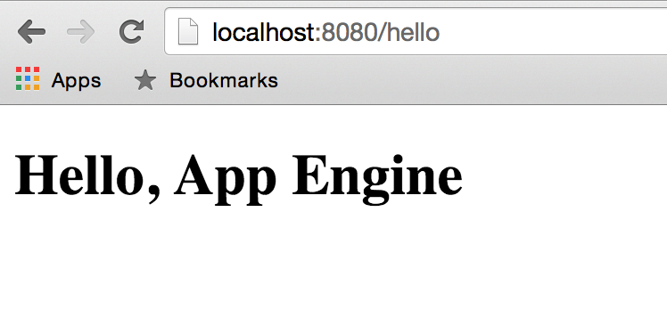

# 5: Hello, HTML

In this chapter you will learn how to serve HTML pages on App Engine and how to
make the HTML and JavaScript components communicate with your Go code.

## Only static content

For now let's start with a simple HTML page:

[embedmd]:# (all_static/hello.html /.*DOCTYPE/ $)
```html
<!DOCTYPE html>

<html>
<head>
  <title>Hello, App Engine</title>
</head>
<body>
  <h1>Hello, App Engine</h1>
</body>
</html>
```

We can create a new `app.yaml` to serve this static page:

[embedmd]:# (all_static/app.yaml)
```yaml
runtime: go
api_version: go1

handlers:
- url: /hello
  static_files: hello.html
  upload: hello.html
```

As you can see we are handling the requests with path `/hello` displaying
the contents of the `hello.html` file.

Try running your application locally (you can find all the files
[here](./all_static)). This should fail, because the Go runtime requires
having some Go code in it!

There's two solutions for this:

- use the Python runtime which doesn't require any Python code

- or add some Go code, something as simple as this `dummy.go` file:

[embedmd]:# (all_static/dummy.go /package dummy/ $)
```go
package dummy
```

We will do the latter as we'll add more Go code later on.

Try running your application again:

```bash
$ dev_appserver.py .
```

Or deploying it:

```bash
$ gcloud app deploy app.yaml
```

And verify that the output matches your expectations:



## Serving dynamic content: HTML + Go

Static content is often not enough and we need our web app frontend (HTML + JS)
to communicate with our backend.

To do so we have two different options:

- use `app.yaml` to determine what requests are handled by which part, or
- use multiple modules on possibly different runtimes.

You can learn more about Go modules on this
[documentation](https://cloud.google.com/appengine/docs/go/modules/).

For this workshop we will go with the simple option and just enhance the
previous `app.yaml` to match our requirements.

We will need three components:

- a Go program similar to the previous one,
- an HTML page with pure static content, and
- an `app.yaml` file to glue everything together.

The only part that changes here is the `app.yaml`:

[embedmd]:# (mixed_content/app.yaml)
```yaml
runtime: go
api_version: go1

handlers:
# requests with empty paths are shown the html page.
- url: /
  static_files: hello.html
  upload: hello.html
# requests with the /api/ path are handled by the Go app.
- url: /api/.*
  script: _go_app
```

Try changing the `/api/hello` url on the second handler to `/api/backend`.
Why does it fail? Fix it.

### Accessing the backend from the frontend

This can be done in *many* ways, as many as JavaScript frameworks you can think
of. For this simple example we will simply use [jQuery](https://jquery.com/).


[embedmd]:# (mixed_content/hello.html /.*DOCTYPE/ $)
```html
<!DOCTYPE html>

<html>
<head>
	<title>Hello, App Engine</title>
	<script src="https://ajax.googleapis.com/ajax/libs/jquery/2.1.4/jquery.min.js"></script>
</head>
<body>
	<h1>Hello, App Engine</h1>
	<p>The backend says: <span id="message"></span></p>
	<script>
		$(function() {
			$("#message").load("/api/hello");
		});
	</script>
</body>
</html>
```

## Directory organization for bigger applications

As you can imagine very soon you will want to serve many static files, some
HTML, JavaScript, CSS, etc. Rather than listing each of those on your `app.yaml`
there's a much simpler option once you put all of them in a single directory.

	my_app
	|- app.yaml
	|- hello.go
	\- static
	   |- index.html
	   |- style.css
	   \- script.js

Your `app.yaml` in this case will look like this:

[embedmd]:# (static_dirs/app.yaml /runtime/ $)
```yaml
runtime: go
api_version: go1

handlers:
# requests starting with /api/ are handled by the Go app.
- url: /api/.*
  script: _go_app

# if the path is empty show index.html.
- url: /
  static_files: static/index.html
  upload: static/index.html

# otherwise try to find it in the static directory.
- url: /
  static_dir: static
```

This kind of structure provides a clear structure of the application.

## Exercise: let's build a whole app!

OK, we know now enough stuff to build an application. So, let's do it! 🎉

Have a look at this [introduction](../events) describing the application
and implement *ONLY* [step 0](../events/step0/README.md). Then come back for more.

# Congratulations!

You just created your first application where a web frontend communicates with
your Go backend!

But, shouldn't the backend generate JSON rather than plain text?
Let's learn about JSON encoding and decoding on the [next section](../section06/README.md).
