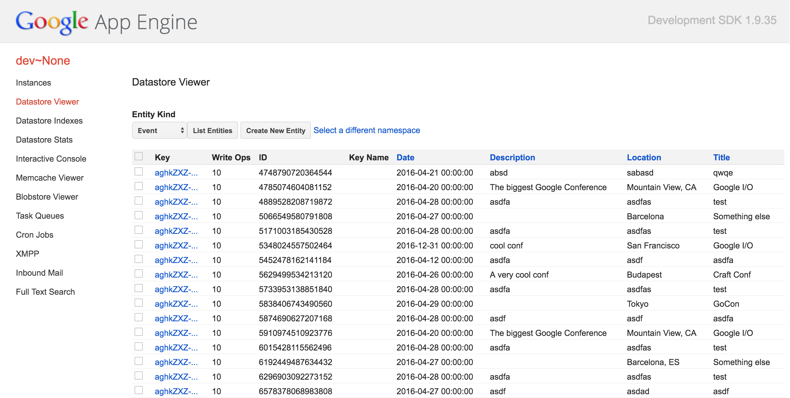

# 7: Durable storage with Cloud Datastore

In this chapter you will learn the basics about the Google Cloud Datastore and
how it is the perfect companion to your App Engine apps.

## Introduction to Cloud Datastore

Cloud Datastore is a non relational database that is fully managed by Google so
you don't need to worry about scaling, resizing, patches, or any other kind of
mantainance.

<div style="text-align:center">
  
</div>

You can find more information on Cloud Datastore
[here](https://cloud.google.com/datastore/docs/concepts/overview?hl=en) but for
this tutorial just consider Cloud Datastore as the easiest way to store
structured data from your App Engine app.

## Using Cloud Datastore from Go on App Engine

The Go runtime on App Engine provides a suite of packages that give access to
many of the services that you might want to use from a web application. One of
those is Cloud Datastore, and the API is very well
[documented](https://cloud.google.com/appengine/docs/go/datastore/).

There are three concepts that you need to understand before you start using the
Datastore:

1. entities,
1. kinds, and
1. keys.

An entity is a value stored in the datastore. This is somehow similar to a row
stored in a relational database, it has a list of fields and its corresponding
values. But unlike relational datastores there's no schema describing those rows
and each entity can have a different set of fields.

Entities are of a given kind, the same way rows in relational databases belong
to a given table. Given the type `Person` that we used before we could imagine
having a kind `Person` in the datastore.

All values in the datastore are stored attached to a key. Keys are the way to
identify and refer to the values in the datastore. There are two types of keys:

- complete keys: which actually point to a value in the datastore
- incomplete keys: used when a value is still not in the datastore

We'll see more about incomplete keys in a minute.

# Storing data in the Datastore

The [`google.golang.org/appengine/datastore`](https://godoc.org/google.golang.org/appengine/datastore)
package provides a `Put` function:

```go
func Put(c context.Context, key *Key, src interface{}) (*Key, error)
```

- The first parameter is an `context.Context` which is the way we link all the
operations that are related to a given request together.

- The second parameter is a ```*datastore.Key``` and you can see how to create
one in the code snippet below.

- Finally, the last parameter is the value to be stored.

- The function returns another ```*datastore.Key``` and an error which will be
non nil if some error occurs while storing the data.

Let's see an example of how to use the `datastore.Put` function:

```go
package app

import (
	"fmt"
	"net/http"

	"google.golang.org/appengine"
	"google.golang.org/appengine/datastore"
)

// Person contains the name and age of a person.
type Person struct {
	Name     string
	AgeYears int
}

func handler(w http.ResponseWriter, r *http.Request) {
	p := &Person{"gopher", 5}

	// create a new App Engine context from the HTTP request.
	ctx := appengine.NewContext(r)
	// create a new complete key of kind Person and value gopher.
	key := datastore.NewKey(ctx, "Person", "gopher", 0, nil)
	// put p in the datastore.
	key, err := datastore.Put(ctx, key, p)
	if err != nil {
		http.Error(w, err.Error(), http.StatusInternalServerError)
		return
	}
	fmt.Fprintf(w, "gopher stored with key %v", key)
}
```

Execute this code locally and observe how every time the handler is executed
the value of the key is the same every time: `/Person,gopher`.

As you can see we're creating a `datastore.Key` calling `datastore.NewKey`:

```go
func NewKey(c context.Context, kind, stringID string, intID int64, parent *Key) *Key
```

When creating a complete key you need to choose between wheter you will use a
`string` value (as in the example) or an `int64`. One and only one of the fields
`stringID` and `intID` should be empty (`""` or `0`).

The last parameter is a ```*datastore.Key``` pointing to the parent of the key
we're creating. For now we will use always nil.

## Using incomplete keys

What if we don't know the exact key we want to use? For instance different
values of `Person` could have the same name and right their keys would be the
same therefore overwriting each other.

The solution is to use an autogenerated key, which is exactly what incomplete
keys are for. We create them with `datastore.NewIncompletekey`:

```go
func NewIncompleteKey(c context.Context, kind string, parent *Key) *Key
```

Note that there's no `stringID` or `intID` in this function, as the final value
of the key will be decided once we put the value in the datastore. The final
value can be obtained by using the the returned key by `datastore.Put`.

```go
func handler(w http.ResponseWriter, r *http.Request) {
	p := &Person{"gopher", 5}

	// create a new App Engine context from the HTTP request.
	ctx := appengine.NewContext(r)
	// create a new complete key of kind Person.
	key := datastore.NewIncompleteKey(ctx, "Person", nil)
	// put p in the datastore.
	key, err := datastore.Put(ctx, key, p)
	if err != nil {
		http.Error(w, err.Error(), http.StatusInternalServerError)
		return
	}
	fmt.Fprintf(w, "gopher stored with key %v", key)
}
```

If you use this handler in your application you will see that the generated key
is a different one every time and it doesn't follow any specific order.

# The Datastore admin page

If you're running your application locally you can investigate the contents of
the local datastore by visiting http://localhost:8000/datastore.

</img>

If you want to investigate the content of the Cloud Datastore for an App Engine
app deployed to production you can visit
[this page](https://console.developers.google.com/project/_/datastore/stats).


# Retrieving data from Google Cloud Datastore

There are two main ways of retrieving data from the Google Cloud Datastore:

- retrieving values given their keys, or
- querying the datastore using filters.

## Retrieving with keys

If we have a key, retrieving a value from the Datastore is as simple as calling
the `datastore.Get` function:

```go
func Get(c context.Context, key *Key, dst interface{}) error
```

The last parameter should be a pointer to a struct containing the fields that we
want to retrieve, for instance:

```go
ctx := appengine.NewContext(r)

key := datastore.NewKey(ctx, "Person", "gopher", 0, nil)

var p Person
err := datastore.Get(ctx, key, &p)
if err != nil {
	// handle the error
}
```

There's also a version of this function that allows us to retrieve multiple
values at a time, therefore improving performance when we can batch operations.

The function is `datastore.GetMulti`:

```go
func GetMulti(c context.Context, key []*Key, dst interface{}) error
```

## Retreiving without keys

Very often we want to find all the values in the datastore that match some
conditions, such as all the values of a kind, or all the values where a given
field equals some specific value. This is similar to SQL `SELECT` statements.

They way to do this with the Datastore is using the type `datastore.Query`.
Values of `datastore.Query` can be created with `datastore.NewQuery`:

```go
func NewQuery(kind string) *Query
```

As you can see all queries are attached to a given kind. Once we have a query
we can add filters using the builder pattern and some of these methods:

```go
func (q *Query) Ancestor(ancestor *Key) *Query
```
```go
func (q *Query) Filter(filterStr string, value interface{}) *Query
```
```go
func (q *Query) KeysOnly() *Query
```
```go
func (q *Query) Limit(limit int) *Query
```
```go
func (q *Query) Order(fieldName string) *Query
```

And finally we can get the values that match our query by executing the query:

```go
func (q *Query) Count(c context.Context) (int, error)
```
```go
func (q *Query) GetAll(c context.Context, dst interface{}) ([]*Key, error)
```
```go
func (q *Query) Run(c context.Context) *Iterator
```

- Count returns how many values matched the query
- GetAll retrieves all the values that matched the query into `dst`
- Run returns a ```*datastore.Iterator``` that we can use to iterate over
all the results matching the query.

Let's see an example where we retrieve all the values of kind `Person` that
are 10 years old or younger ordered by their name.

```go
ctx := appengine.NewContext(r)

var p []Person

// create a new query on the kind Person
q := datastore.NewQuery("Person")

// select only values where field Age is 10 or lower
q = q.Filter("Age <=", 10)

// order all the values by the Name field
q = q.Order("Name")

// and finally execute the query retrieving all values into p.
_, err := q.GetAll(ctx, &p)
if err != nil {
	// handle the error
}
```

You can find more information about Datastore Query
[here](https://cloud.google.com/appengine/docs/go/datastore/queries).

# Exercise: add durable storage to the events app

Now that you know everything that there is to know (for today) for the Datastore,
let's use it to make the data stored in the events application durable.

Go work on the [step two](../events/step2/README.md) and come back here when you're done.

# Congratulations!

You are now able to store and retrieve data from the Google Cloud Datastore.
With this you're now ready to build pretty much any application you can imagine!

Or do you want more? In that case go the
[next chapter](../section08/README.md) to learn how to access remote
resources using `urlfetch`.
