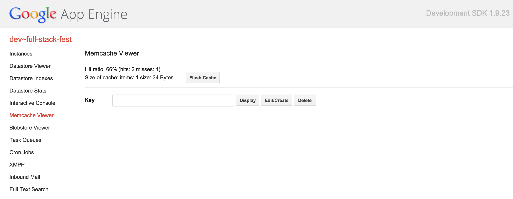
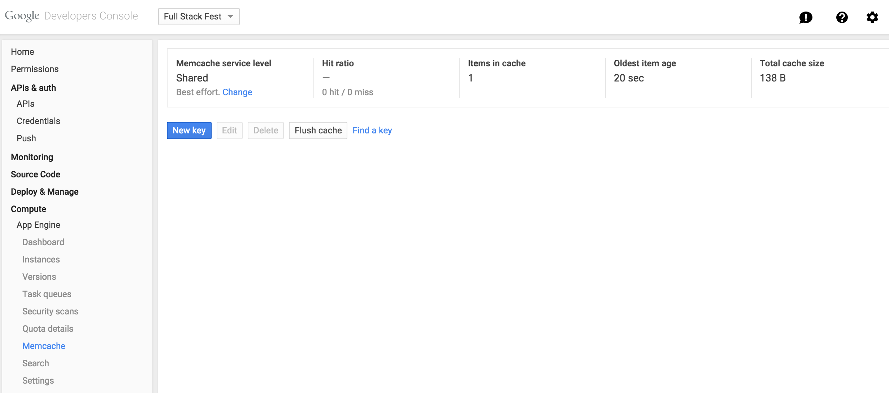

# 9: What is Memcache and how to use it from App Engine

Memcache is one of the most well known caching system, developed originally by
[Brad Fitzpatrick](https://twitter.com/bradfitz), a current member of the Go team!

App Engine provides a way an incredibly simple way to use Memcache, similarly to
the way you can use Datastore. You get access to completely managed Memcache
instances that are maintained, scaled, and updated by Google so you don't need to
care about anything other than your business.

Memcache will keep your data for a period of time you can specify and will drop
the values once a given time has passed. You should not store anything that
you can't recover in Memcache, as there's no durability warranty. In other
words, if Memcache was not working your application should still work perfectly,
even though it would probably be a bit slower.

## Using it from the Go App Engine runtime

As for the packages seen before there's a package provided by the Go runtime
named [`google.golang.org/appengine/memcache`](https://godoc.org/google.golang.org/appengine/memcache).

There's two main operations you can do with memcache:

- caching data with `memcache.Set`, and
- retrieve data back with `memcache.Get`.

### Caching data

We will use the `memcache.Set` function:

```go
func Set(c appengine.Context, item *Item) error
```

The first parameter is an `appengine.Context`, as usual, and the second one is
the item we want to store. Let's concentrate on three fields of the
`memcache.Item` type for now:

```go
type Item struct {
	Key        string
	Value      []byte
	Expiration time.Duration

	// I removed some fields for clarity here
}
```

- Keys, which are simple strings, let you identify values.
- Values are a slice of bytes of up to 1Mb in size.
- The Expiration fields indicates for how long the value is valid.

So if we want to store an item with key "name" and value "gopher" that will be
valid for one hour we could write:

[embedmd]:# (getset/app.go /package app/ /^}/)
```go
package app

import (
	"fmt"
	"net/http"
	"time"

	"google.golang.org/appengine"
	"google.golang.org/appengine/memcache"
)

func set(w http.ResponseWriter, r *http.Request) {
	ctx := appengine.NewContext(r)

	// get the parameters k and v from the request
	key := r.FormValue("k")
	value := r.FormValue("v")

	item := &memcache.Item{
		Key:        key,
		Value:      []byte(value),
		Expiration: 1 * time.Hour,
	}

	err := memcache.Set(ctx, item)
	if err != nil {
		http.Error(w, err.Error(), http.StatusInternalServerError)
	}
}
```

### Retrieving cache data

To retrieve an item from Memcache we use the `memcache.Get` function:

```go
func Get(c appengine.Context, key string) (*Item, error)
```

Given a key `memcache.Get` returns the corresponding item if any, containing the
store value in the `Value` field. If the key was not found in the cache the
returned error is `memcache.ErrCacheMiss`.

Let's retrieve the value we cached on the previous code:

[embedmd]:# (getset/app.go /func get/ /^}/)
```go
func get(w http.ResponseWriter, r *http.Request) {
	ctx := appengine.NewContext(r)

	key := r.FormValue("k")

	item, err := memcache.Get(ctx, key)
	switch err {
	case nil:
		fmt.Fprintf(w, "%s", item.Value)
	case memcache.ErrCacheMiss:
		fmt.Fprint(w, "key not found")
	default:
		http.Error(w, err.Error(), http.StatusInternalServerError)
	}
}
```

You can see a complete example of an application using Memcache [here](getset).

Test it with `curl` or [Postman](https://chrome.google.com/webstore/detail/fdmmgilgnpjigdojojpjoooidkmcomcm?utm_source=chrome-ntp-launcher).

## Using Codecs

As you can imagine using Memcache to store structure data this way can be a
little bit of a hassle, that's why the package also offers a way to use
coders and encoders, aka codecs, such as JSON.

When using codecs rather than setting the `Value` field of the `memcache.Item`
you should use the `Object` field instead. For instance you can cache and
retrieve a `Person` using the JSON codec like this:

[embedmd]:# (codec/app.go /func set/ /^}/)
```go
func set(w http.ResponseWriter, r *http.Request) {
	ctx := appengine.NewContext(r)

	var p Person
	if err := json.NewDecoder(r.Body).Decode(&p); err != nil {
		http.Error(w, err.Error(), http.StatusBadRequest)
		return
	}

	item := &memcache.Item{
		Key:        "last_person",
		Object:     p, // we set the Object field instead of Value
		Expiration: 1 * time.Hour,
	}

	// we use the JSON codec
	err := memcache.JSON.Set(ctx, item)
	if err != nil {
		http.Error(w, err.Error(), http.StatusInternalServerError)
	}
}
```

And to retrieve it it's even simpler:

[embedmd]:# (codec/app.go /func get/ /^}/)
```go
func get(w http.ResponseWriter, r *http.Request) {
	ctx := appengine.NewContext(r)

	var p Person
	_, err := memcache.JSON.Get(ctx, "last_person", &p)
	if err == nil {
		json.NewEncoder(w).Encode(p)
		return
	}
	if err == memcache.ErrCacheMiss {
		fmt.Fprint(w, "key not found")
		return
	}
	http.Error(w, err.Error(), http.StatusInternalServerError)
}
```

You can see a complete example of an application using the JSON code
[here](codec).

## The Memcache viewer page

Similarly to the Datastore admin page, you can check some statistics and find
what keys are stored or used in a Memcache instance accessing the Memcache
viewer page.

If you're running your application locally you can access
http://localhost:8000/memcache:

</img>

If you want to view the statistics on a production instance you can use the
Developers Console
[here](https://console.developers.google.com/project/_/appengine/memcache):

</img>

# Exercise: make the events app faster with memcache

Remember the events app? Remember how it spent most of its time fetching weather
information from the openweathermap.org API? Let's fix that with
[step 4](../events/step4/README.md).

# Congratulations!

You're now not only able to cache and retrieve data in Memcache, but also to
do so with structured data thanks to the JSON codec!

Go to the [next section](../section10/README.md) for a couple of surprises!
